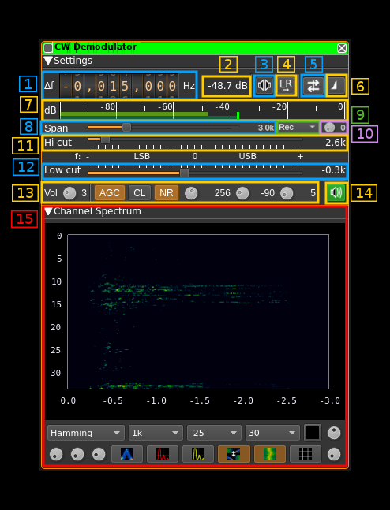
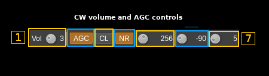

<h1>CW demodulator plugin</h1>

<h2>Introduction</h2>

This plugin can be used to listen to a CW (Continuous Wave / Morse code) signal. Internally it relies on the same single sideband (SSB) demodulation chain as the SSB demodulator, configured for narrow-band CW reception. CW signals are received as keyed tones inside a narrow USB or LSB filter, so the plugin behaves like a narrow SSB receiver tuned around the desired sidetone offset.

This plugin was derived from the SSB/DSB demodulator and exposes the same DSP and audio controls. It opens with CW-friendly startup defaults already applied, so you can usually listen immediately after loading the plugin. The recommended setup for CW is:

  - SSB mode (the DSB toggle should be left disabled)
  - A narrow channel bandwidth (typically 200&nbsp;Hz to 600&nbsp;Hz)
  - A low-cut frequency a few hundred hertz below the desired tone so the operator hears a comfortable beat note

<h2>Interface</h2>

The top and bottom bars of the channel window are described [here](../../../sdrgui/channel/readme.md)

&#9758; In order to toggle USB or LSB mode you have to set the "BW" in channel filter cutoff control (9) to a positive (USB) or negative (LSB) value.

&#9758; The channel marker in the main spectrum display shows the actual band received taking in channel filtering into account.

<h3>1: Frequency shift from center frequency of reception</h3>

Use the wheels to adjust the frequency shift in Hz from the center frequency of reception. Left click on a digit sets the cursor position at this digit. Right click on a digit sets all digits on the right to zero. This effectively floors value at the digit position. Wheels are moved with the mousewheel while pointing at the wheel or by selecting the wheel with the left mouse click and using the keyboard arrows. Pressing shift simultaneously moves digit by 5 and pressing control moves it by 2.

<h3>2: Channel power</h3>

Average total power in dB relative to a +/- 1.0 amplitude signal received in the pass band.

<h3>3: Monaural/binaural toggle</h3>

  - Monaural: the scalar signal is routed to both left and right audio channels
  - Binaural: the complex signal is fed with the real part on the left audio channel and the imaginary part to the right audio channel

<h3>4: Invert left and right channels</h3>

Inverts left and right audio channels. Useful in binaural mode only.

<h3>5: Sideband flip</h3>

Flip LSB/USB. Mirror filter bandwidth around zero frequency and change from LSB to USB or vice versa.

<h3>6: SSB/DSB demodulation</h3>

For CW reception the plugin should be left in SSB mode (one sideband icon). The DSB mode is preserved from the underlying SSB demodulator but is not normally useful for CW.

<h3>7: Level meter in dB</h3>

  - top bar (green): average value
  - bottom bar (blue green): instantaneous peak value
  - tip vertical bar (bright green): peak hold value

<h3>8: Spectrum display frequency span</h3>

The audio sample rate SR is further decimated by powers of two for the spectrum display and in channel filter limits. This effectively sets the total available bandwidth depending on the decimation:

  - 1 (no decimation): SR/2
  - 2: SR/4
  - 4: SR/8
  - 8: SR/16
  - 16: SR/32

For CW work, smaller spans (higher decimation) are usually preferred so the narrow CW filter occupies a useful fraction of the spectrum view.

<h3>9: FFT filter window</h3>

The bandpass filter is a FFT filter. This controls the FFT window type:

  - **Bart**: Bartlett
  - **B-H**: 4 term Blackman-Harris
  - **FT**: Flat top
  - **Ham**: Hamming
  - **Han**: Hanning
  - **Rec**: Rectangular (no window)
  - **Kai**: Kaiser with alpha = 2.15 (beta = 6.76) gives sidelobes &lt; -70dB
  - **Blackman**: Blackman (3 term - default)
  - **B-H7**: 7 term Blackman-Harris

<h3>10: Select filter in filter bank</h3>

There are 10 filters in the filter bank with indexes 0 to 9. This selects the current filter in the bank the filter index is displayed at the right of the button. The startup preset seeds the bank with CW-oriented values, and the following controls are covered by the filter settings:

Preset 0 is the startup preset; presets 1–9 are the additional CW filter-bank entries.

| Index | Startup preset | Filter settings |
|-------| --- | --- |
| 0     | 300 Hz passband centered on 600 Hz | `BW = 0.75 kHz`, `Low cut = 0.45 kHz` |
| 1     | CW preset | `BW = 0.1 kHz`, `Low cut = 0 kHz` |
| 2     | CW preset | `BW = 0.2 kHz`, `Low cut = 0 kHz` |
| 3     | CW preset | `BW = 0.4 kHz`, `Low cut = 0 kHz` |
| 4     | CW preset | `BW = 0.6 kHz`, `Low cut = 0 kHz` |
| 5     | CW preset | `BW = 0.8 kHz`, `Low cut = 0.4 kHz` |
| 6 - 9 | CW preset | `BW = 1.0 kHz`, `Low cut = 0.4 kHz` |

Rows 6–9 intentionally repeat the same safe fallback values so the remaining filter-bank slots start with a usable CW preset.

  - Span (8)
  - FFT window (9)
  - BW (11)
  - Low cut (12)

<h3>11: "BW": In channel bandpass filter cutoff frequency farthest from zero</h3>

Values are expressed in kHz and step is 100 Hz.

This is the upper (USB: positive frequencies) or lower (LSB: negative frequencies) cutoff of the in channel single side band bandpass filter. The value triggers LSB mode when negative and USB when positive. The default CW startup preset uses 0.75 kHz here, which together with the low cut below gives a 300 Hz passband centered on a 600 Hz sidetone. If you want to retune manually, set this just above the desired sidetone offset.

<h3>12: "Low cut": In channel bandpass filter cutoff frequency closest to zero</h3>

Values are expressed in kHz and step is 100 Hz.

This is the lower cutoff (USB: positive frequencies) or higher cutoff (LSB: negative frequencies) of the in channel single side band bandpass filter. The default CW startup preset uses 0.45 kHz here to pair with the 0.75 kHz high cutoff and center the passband on a 600 Hz tone. If you want to retune manually, set this just below the desired sidetone offset.

<h3>13: Volume AGC Noise Reduction</h3>

<h4>13.1: Volume</h4>

This is the volume of the audio signal in dB from 0 (no gain) to 40 (10000). It can be varied continuously in 1 dB steps using the dial button. When AGC is engaged it is recommended to set a low value in dB not exceeding 3 dB (gain 2). When AGC is not engaged the volume entirely depends on the RF power and can vary in large proportions. Setting the value in dB is therefore convenient to accommodate large differences.

<h4>13.2: AGC toggle</h4>

Use this checkbox to toggle AGC on and off.

For weak CW signals you will probably leave AGC off. AGC is intended for medium and large signals and helps accommodate the signal power variations from a station to another or due to QSB.

This AGC is based on the calculated magnitude (square root of power of the filtered signal as I&sup2; + Q&sup2;) and will try to adjust audio volume as if a -20 dB power signal was received.

<h4>13.3: AGC clamping</h4>

This limits AGC gain when signal rises up sharply, avoiding peak audio overload. Useful with strong CW keying transients.

<h4>13.4: Noise Reduction</h4>

This is a FFT based noise reduction. It is particularly useful for CW because the **Peaks** scheme can act as a single-tone peak filter, isolating the CW carrier from background noise.

Use this button to toggle noise reduction on/off. Right click on this button to open a dialog controlling noise reduction filter characteristics.

<h4>13.4.1: Noise reduction scheme</h4>

  - **Average**: thresholds against the average FFT magnitude.
  - **Avg Std Dev**: thresholds against average plus a fraction of the standard deviation.
  - **Peaks**: keeps only the N strongest FFT bins. With N = 1 this becomes a peak filter ideal for CW.

<h4>13.4.2: Noise reduction parameter</h4>

  - With average this is the multiplier of the average.
  - With average and standard deviation this is the standard deviation (sigma) multiplier.
  - With FFT peaks this is the number of peaks (N).

<h4>13.4.3: Smoothing filter constant (alpha)</h4>

Controls the time constant of the exponential smoothing filter applied to the threshold. Refer to the SSB demodulator documentation for the full equation; for CW a small time constant works well so the filter responds quickly to keyed transitions.

<h4>13.4.4: Smoothing filter time constant</h4>

The resulting time constant of the smoothing filter is displayed here in seconds.

<h4>13.5: AGC time constant</h4>

This is the time window in milliseconds of the moving average used to calculate the signal power average. It can be varied in powers of two from 16 to 2048 ms. The CW startup default is 32 ms (dial value 5), and for CW shorter values (16 to 128 ms) follow the keying envelope better.

<h4>13.6: Signal power threshold (squelch)</h4>

Active only in AGC mode. Mutes audio below this average signal power. Refer to the SSB demodulator documentation for full details.

To turn off the squelch completely move the knob all the way down (left). Then "---" will display as the value and the squelch will be disabled.

<h4>13.7: Signal power threshold (squelch) gate</h4>

Active only in AGC mode with squelch enabled. Sets the minimum duration the signal must remain above threshold before the squelch opens.

<h3>14: Audio mute and audio output select</h3>

Left click on this button to toggle audio mute for this channel.

Right click on it to open a dialog to select the audio output device. See [audio management documentation](../../../sdrgui/audio.md) for details.

<h3>15: Spectrum display</h3>

This is the spectrum display of the demodulated signal. Controls on the bottom of the panel are identical to the ones of the main spectrum display. Details on the spectrum view and controls can be found [here](../../../sdrgui/gui/spectrum.md)

